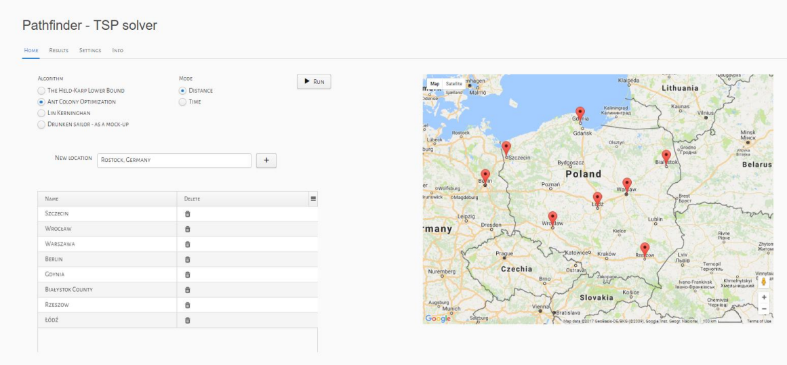
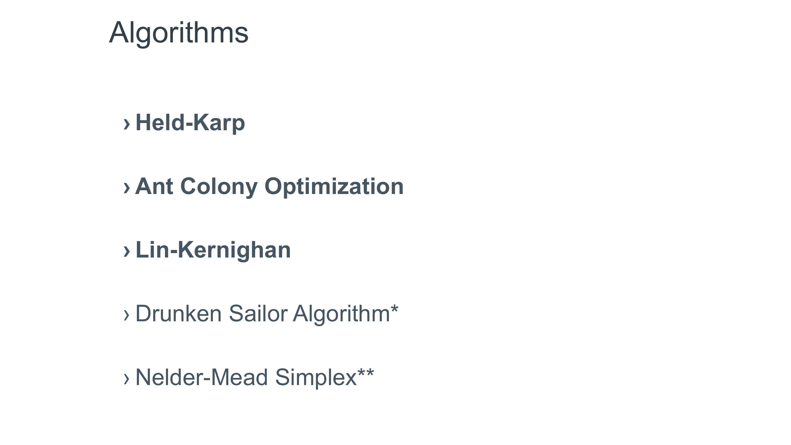
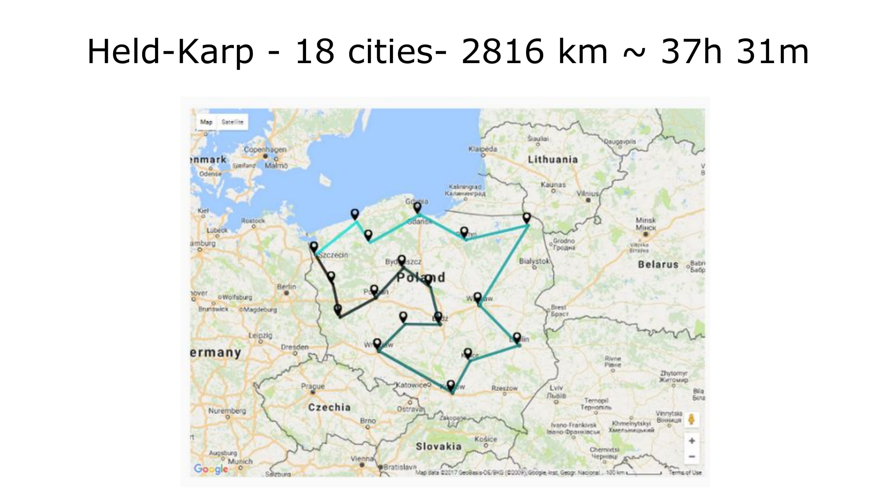
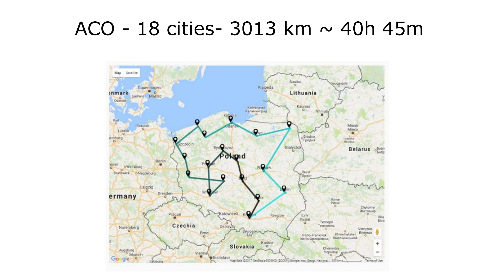
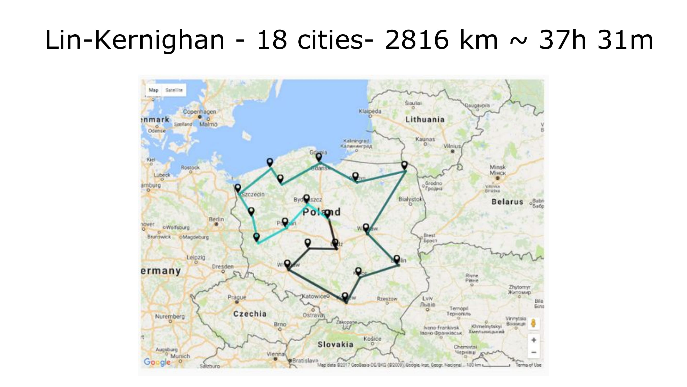
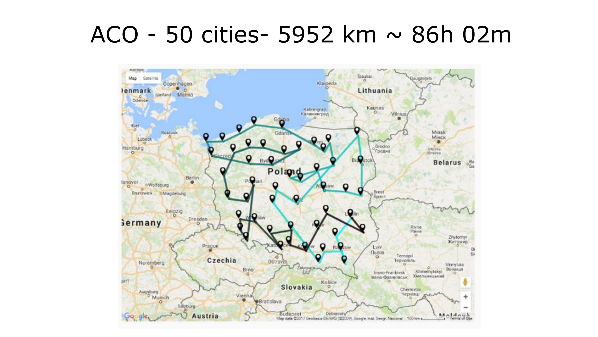
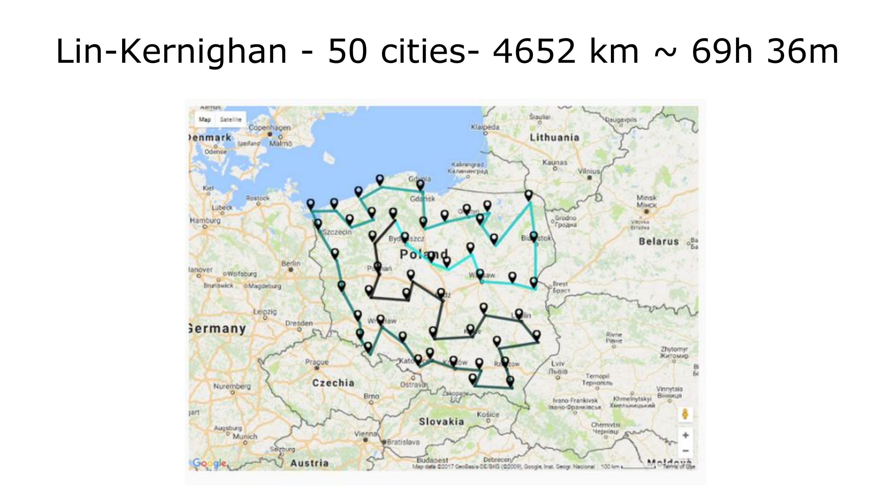
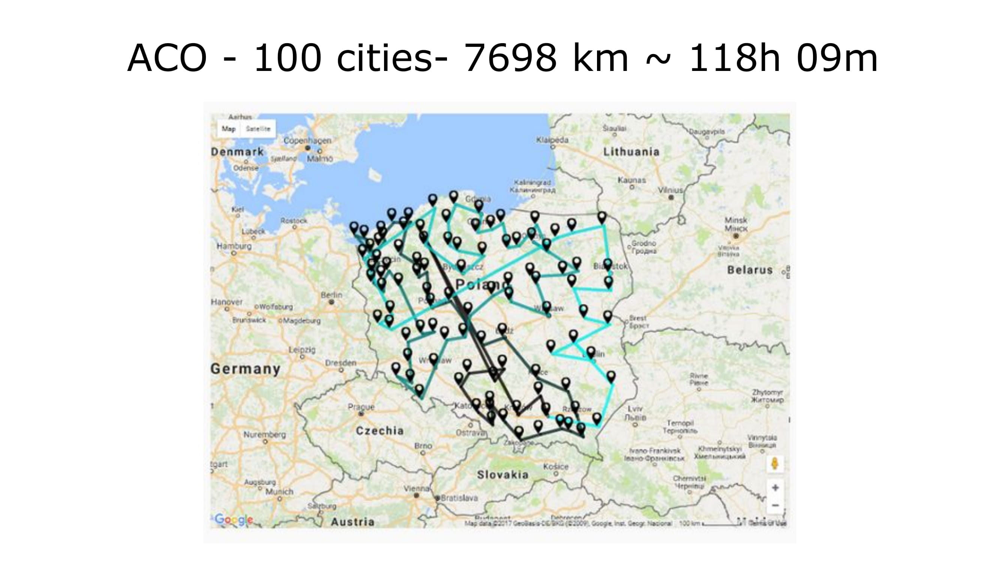
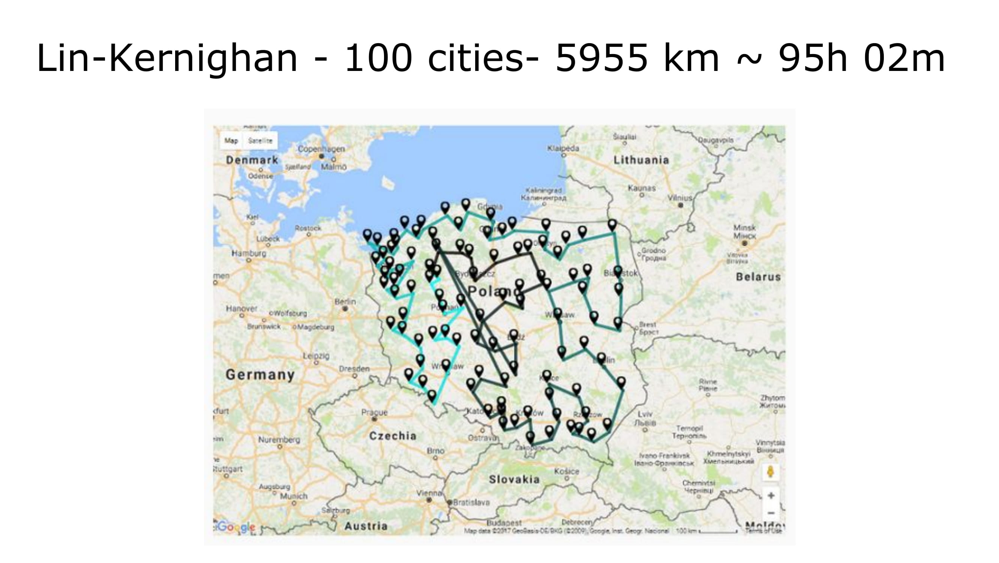

PathFinder
==============

Master's thesis repository with sourcecode of Pathfinder application.

The purpose of this application is to provide a tool with implementation of differnt optimization algorithms for Travelling Salesman Problem.

Application uses MongoDB for storing list of locations' objects that are sent to the input of different algorithms.

Example screenshots:

home view:

Algorithms used:

Calculated paths:

